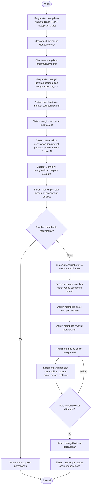

## **4.3.2 Activity Diagram**

Activity Diagram digunakan untuk menggambarkan alur proses atau aktivitas yang terjadi dalam Modul Live Chat Hybrid dengan integrasi Chatbot Gemini AI pada Website Portal Informasi dan Publikasi Dinas PUPR Kabupaten Garut. Diagram ini menunjukkan urutan aktivitas yang dilakukan oleh masyarakat, sistem, chatbot Gemini AI, dan admin, mulai dari masyarakat membuka widget live chat, mengirim pertanyaan, menerima respons otomatis, melakukan verifikasi kepuasan jawaban, hingga percakapan dialihkan kepada admin apabila jawaban chatbot belum memenuhi kebutuhan informasi masyarakat.

Pada modul live chat hybrid, proses percakapan diawali ketika masyarakat mengakses halaman website Dinas PUPR Kabupaten Garut dan membuka widget live chat. Sistem kemudian menampilkan antarmuka percakapan serta membuat sesi percakapan baru. Pertanyaan yang dikirim masyarakat akan disimpan sebagai riwayat percakapan dan diproses oleh Chatbot Gemini AI dengan memanfaatkan konteks informasi yang tersedia pada website. Apabila jawaban chatbot sudah memenuhi kebutuhan masyarakat, sesi percakapan dapat diakhiri. Namun, apabila masyarakat menyatakan bahwa jawaban belum sesuai atau sistem mendeteksi kebutuhan penanganan lebih lanjut, percakapan akan dialihkan kepada admin melalui mekanisme handover. Admin kemudian dapat melihat sesi percakapan pada dashboard, membaca riwayat percakapan, membalas pesan masyarakat, dan mengakhiri sesi setelah pertanyaan selesai ditangani.

_Gambar 4-5 Activity Diagram Modul Live Chat Hybrid_

## **4.3.3 Skenario Use Case**

Skenario use case menjelaskan secara rinci alur interaksi antara aktor dan sistem untuk setiap use case pada Modul Live Chat Hybrid dengan integrasi Chatbot Gemini AI. Setiap skenario mencakup identifikasi use case, kondisi awal atau prekondisi, kondisi akhir atau postkondisi, alur utama, serta alur alternatif yang menangani kondisi tidak biasa atau kesalahan yang dapat terjadi selama proses penggunaan sistem.

_Tabel 4-14 Skenario UC-01: Mengirim Pertanyaan melalui Live Chat_

| | | | |
|---|---|---|---|
|**Identifikasi**||||
|||**UC-01**||
|**Use Case ID**||||
|||Mengirim Pertanyaan melalui Live Chat||
|**Nama Use Case**||||
|||Masyarakat||
|**Aktor**||||
|||Masyarakat mengakses halaman website Dinas PUPR Kabupaten Garut dan widget live chat tersedia pada halaman website||
|**Prekondisi**||||
|||Pertanyaan masyarakat tersimpan pada sesi percakapan dan siap diproses oleh chatbot Gemini AI||
|**Postkondisi**||||
|||Memungkinkan masyarakat mengirim pertanyaan layanan informasi melalui kanal live chat pada website tanpa harus melakukan registrasi akun||
|**Tujuan**||||
|||||
|**Skenario Utama**||||
|||||
|**Kondisi Awal: Halaman Website Dinas PUPR Kabupaten Garut**||||
|**No**|**Aktor**||**Sistem**|
|1|Masyarakat mengakses halaman Website Portal Informasi dan Publikasi Dinas PUPR Kabupaten Garut|||
|2|||Sistem menampilkan halaman website beserta widget live chat|
|3|Masyarakat membuka widget live chat|||
|4|||Sistem menampilkan antarmuka percakapan yang berisi kolom pesan serta field identitas opsional seperti nama dan email|
|5|Masyarakat mengisi identitas opsional dan mengetik pertanyaan yang ingin diajukan|||
|6|Masyarakat menekan tombol kirim pesan|||
|7|||Sistem memvalidasi isi pesan yang dikirim masyarakat|
|8|||Sistem membuat sesi percakapan baru dengan session token apabila masyarakat belum memiliki sesi aktif|
|9|||Sistem menyimpan pesan masyarakat ke dalam tabel chat_messages dengan relasi ke tabel chat_sessions|
|10|||Sistem menampilkan pesan masyarakat pada antarmuka live chat|
|||||
|**Kondisi Akhir: Pesan Masyarakat Tersimpan pada Sesi Percakapan**||||
|||||
|**Skenario Alternatif**||||
|**No**|**Kondisi**|**Aksi Sistem**||
|7a|Pesan kosong atau tidak sesuai validasi|Sistem menampilkan pesan kesalahan dan tidak menyimpan pesan ke basis data||
|7b|Panjang pesan melebihi batas maksimal|Sistem menampilkan pesan kesalahan bahwa pertanyaan terlalu panjang dan masyarakat diminta memperpendek pesan||
|8a|Sesi percakapan sebelumnya sudah ditutup|Sistem menolak pengiriman pesan pada sesi lama dan meminta masyarakat memulai sesi percakapan baru||

_Tabel 4-15 Skenario UC-02: Menerima Jawaban Chatbot_

| | | | |
|---|---|---|---|
|**Identifikasi**||||
|||**UC-02**||
|**Use Case ID**||||
|||Menerima Jawaban Chatbot||
|**Nama Use Case**||||
|||Masyarakat||
|**Aktor**||||
|||Masyarakat telah mengirim pertanyaan melalui live chat dan sesi percakapan berada pada status bot||
|**Prekondisi**||||
|||Jawaban chatbot ditampilkan kepada masyarakat dan tersimpan sebagai bagian dari riwayat percakapan||
|**Postkondisi**||||
|||Memberikan respons otomatis kepada masyarakat terhadap pertanyaan yang berkaitan dengan informasi layanan Dinas PUPR Kabupaten Garut||
|**Tujuan**||||
|||||
|**Skenario Utama**||||
|||||
|**Kondisi Awal: Pesan Masyarakat Berhasil Dikirim**||||
|**No**|**Aktor**||**Sistem**|
|1|Masyarakat menunggu jawaban setelah mengirim pertanyaan|||
|2|||Sistem mengambil riwayat percakapan terakhir pada sesi yang sedang aktif|
|3|||Sistem meneruskan pertanyaan masyarakat dan riwayat percakapan ke layanan Chatbot Gemini AI|
|4|||Chatbot Gemini AI memproses pertanyaan berdasarkan konteks informasi yang tersedia pada website|
|5|||Chatbot Gemini AI menghasilkan jawaban otomatis|
|6|||Sistem menyimpan jawaban chatbot ke dalam tabel chat_messages dengan sender_type bot|
|7|||Sistem menampilkan jawaban chatbot pada widget live chat secara real-time|
|8|Masyarakat membaca jawaban yang diberikan oleh chatbot|||
|9|||Sistem menampilkan opsi verifikasi apakah jawaban sudah membantu masyarakat|
|||||
|**Kondisi Akhir: Jawaban Chatbot Ditampilkan pada Kanal Percakapan**||||
|||||
|**Skenario Alternatif**||||
|**No**|**Kondisi**|**Aksi Sistem**||
|3a|Koneksi ke layanan Gemini AI gagal|Sistem menampilkan pesan bahwa jawaban otomatis belum dapat diproses dan menawarkan pengalihan kepada admin||
|4a|Pertanyaan masyarakat berada di luar konteks informasi website|Sistem memberikan jawaban terbatas dan menyarankan masyarakat untuk meminta bantuan admin||
|7a|Koneksi real-time mengalami gangguan|Sistem tetap menyimpan jawaban chatbot dan menampilkannya setelah halaman atau sesi percakapan dimuat ulang||

_Tabel 4-16 Skenario UC-03: Mengalihkan Percakapan_

| | | | |
|---|---|---|---|
|**Identifikasi**||||
|||**UC-03**||
|**Use Case ID**||||
|||Mengalihkan Percakapan||
|**Nama Use Case**||||
|||Masyarakat, Admin||
|**Aktor**||||
|||Masyarakat telah menerima jawaban chatbot dan sesi percakapan masih aktif||
|**Prekondisi**||||
|||Status sesi percakapan berubah dari bot menjadi human dan admin memperoleh notifikasi sesi yang perlu ditangani||
|**Postkondisi**||||
|||Mengalihkan percakapan dari chatbot kepada admin apabila jawaban otomatis belum menyelesaikan kebutuhan informasi masyarakat||
|**Tujuan**||||
|||||
|**Skenario Utama**||||
|||||
|**Kondisi Awal: Jawaban Chatbot Sudah Ditampilkan**||||
|**No**|**Aktor**||**Sistem**|
|1|Masyarakat membaca jawaban chatbot|||
|2|||Sistem menampilkan pilihan verifikasi kepuasan jawaban|
|3|Masyarakat memilih bahwa jawaban chatbot belum membantu atau membutuhkan bantuan petugas|||
|4|||Sistem memvalidasi session token dan memastikan sesi percakapan masih aktif|
|5|||Sistem mengubah status sesi percakapan dari bot menjadi human|
|6|||Sistem menyimpan waktu pengalihan percakapan pada field transferred_at|
|7|||Sistem menyimpan pesan pemberitahuan bahwa percakapan akan dialihkan kepada admin|
|8|||Sistem mengirim notifikasi real-time ke dashboard admin melalui Laravel Reverb|
|9|Admin menerima indikator adanya sesi percakapan yang membutuhkan penanganan|||
|||||
|**Kondisi Akhir: Percakapan Berada pada Status Human dan Menunggu Balasan Admin**||||
|||||
|**Skenario Alternatif**||||
|**No**|**Kondisi**|**Aksi Sistem**||
|3a|Masyarakat menyatakan jawaban chatbot sudah membantu|Sistem menutup sesi percakapan dan menyimpan status sesi sebagai closed||
|4a|Session token tidak valid|Sistem menampilkan pesan bahwa sesi percakapan tidak ditemukan||
|4b|Sesi percakapan sudah ditutup|Sistem menampilkan pesan bahwa sesi tidak dapat dialihkan karena sudah berakhir||

_Tabel 4-17 Skenario UC-04: Mengelola Percakapan_

| | | | |
|---|---|---|---|
|**Identifikasi**||||
|||**UC-04**||
|**Use Case ID**||||
|||Mengelola Percakapan||
|**Nama Use Case**||||
|||Admin||
|**Aktor**||||
|||Admin telah login ke dashboard admin dan memiliki hak akses untuk membuka menu chat||
|**Prekondisi**||||
|||Admin dapat melihat daftar sesi percakapan aktif, sesi yang dialihkan kepada admin, sesi tertutup, serta jumlah pesan belum dibaca||
|**Postkondisi**||||
|||Memungkinkan admin memantau dan memilih sesi percakapan masyarakat yang perlu ditangani melalui dashboard pengelolaan live chat||
|**Tujuan**||||
|||||
|**Skenario Utama**||||
|||||
|**Kondisi Awal: Dashboard Admin**||||
|**No**|**Aktor**||**Sistem**|
|1|Admin mengakses menu Chat pada dashboard admin|||
|2|||Sistem menampilkan daftar sesi percakapan dari tabel chat_sessions|
|3|||Sistem menampilkan statistik total sesi, sesi bot, sesi human, sesi closed, dan pesan belum dibaca|
|4|Admin memilih filter status percakapan seperti bot, human, closed, atau all|||
|5|||Sistem menampilkan daftar sesi sesuai filter yang dipilih admin|
|6|Admin memilih salah satu sesi percakapan yang perlu ditangani|||
|7|||Sistem menampilkan detail sesi beserta seluruh riwayat pesan dari masyarakat, chatbot, dan admin|
|8|||Sistem menandai pesan masyarakat pada sesi tersebut sebagai sudah dibaca|
|||||
|**Kondisi Akhir: Detail Percakapan Ditampilkan kepada Admin**||||
|||||
|**Skenario Alternatif**||||
|**No**|**Kondisi**|**Aksi Sistem**||
|2a|Belum ada sesi percakapan|Sistem menampilkan daftar kosong dan statistik bernilai nol||
|5a|Tidak ada sesi sesuai filter yang dipilih|Sistem menampilkan informasi bahwa data percakapan tidak ditemukan||
|7a|Sesi percakapan tidak ditemukan|Sistem menampilkan halaman error atau pesan bahwa sesi tidak tersedia||

_Tabel 4-18 Skenario UC-05: Membalas Pesan_

| | | | |
|---|---|---|---|
|**Identifikasi**||||
|||**UC-05**||
|**Use Case ID**||||
|||Membalas Pesan||
|**Nama Use Case**||||
|||Admin||
|**Aktor**||||
|||Admin telah membuka detail sesi percakapan dan sesi tidak berada pada status closed||
|**Prekondisi**||||
|||Balasan admin tersimpan pada riwayat percakapan dan ditampilkan kepada masyarakat dalam kanal percakapan yang sama||
|**Postkondisi**||||
|||Memungkinkan admin memberikan jawaban langsung kepada masyarakat setelah percakapan dialihkan dari chatbot kepada admin||
|**Tujuan**||||
|||||
|**Skenario Utama**||||
|||||
|**Kondisi Awal: Halaman Detail Percakapan Admin**||||
|**No**|**Aktor**||**Sistem**|
|1|Admin membaca riwayat percakapan masyarakat dan chatbot|||
|2|Admin mengetik balasan pada form pesan|||
|3|Admin menekan tombol kirim balasan|||
|4|||Sistem memvalidasi isi pesan admin|
|5|||Sistem memastikan sesi percakapan belum ditutup|
|6|||Sistem menetapkan admin_id pada sesi percakapan apabila sesi belum memiliki admin penanggung jawab|
|7|||Sistem menyimpan balasan admin ke dalam tabel chat_messages dengan sender_type admin|
|8|||Sistem mengirimkan balasan admin kepada masyarakat secara real-time|
|9|Masyarakat menerima dan membaca balasan admin pada widget live chat|||
|||||
|**Kondisi Akhir: Balasan Admin Tampil pada Widget Live Chat Masyarakat**||||
|||||
|**Skenario Alternatif**||||
|**No**|**Kondisi**|**Aksi Sistem**||
|4a|Pesan balasan kosong|Sistem menampilkan pesan kesalahan dan tidak menyimpan balasan||
|4b|Pesan balasan melebihi batas maksimal|Sistem menampilkan pesan kesalahan bahwa pesan terlalu panjang||
|5a|Sesi percakapan sudah ditutup|Sistem menolak balasan dan menampilkan informasi bahwa sesi sudah ditutup||
|8a|Pengiriman real-time gagal|Sistem tetap menyimpan balasan admin dan pesan akan tampil ketika masyarakat memuat ulang sesi percakapan||

_Tabel 4-19 Skenario UC-06: Mengakhiri Sesi Percakapan_

| | | | |
|---|---|---|---|
|**Identifikasi**||||
|||**UC-06**||
|**Use Case ID**||||
|||Mengakhiri Sesi Percakapan||
|**Nama Use Case**||||
|||Admin||
|**Aktor**||||
|||Admin telah membuka detail sesi percakapan dan pertanyaan masyarakat telah selesai ditangani||
|**Prekondisi**||||
|||Status sesi percakapan berubah menjadi closed dan riwayat percakapan tetap tersimpan sebagai rekam jejak layanan||
|**Postkondisi**||||
|||Memungkinkan admin menutup sesi percakapan setelah kebutuhan informasi masyarakat selesai dilayani||
|**Tujuan**||||
|||||
|**Skenario Utama**||||
|||||
|**Kondisi Awal: Halaman Detail Percakapan Admin**||||
|**No**|**Aktor**||**Sistem**|
|1|Admin memastikan pertanyaan masyarakat sudah dijawab dan tidak memerlukan tindak lanjut|||
|2|Admin menekan tombol untuk mengakhiri sesi percakapan|||
|3|||Sistem mengambil data sesi percakapan berdasarkan id sesi|
|4|||Sistem mengubah status sesi percakapan menjadi closed|
|5|||Sistem menyimpan waktu penutupan sesi pada field closed_at|
|6|||Sistem membuat pesan pemberitahuan bahwa sesi percakapan telah ditutup oleh admin|
|7|||Sistem mengirim pemberitahuan penutupan sesi kepada masyarakat|
|8|||Sistem menyimpan seluruh riwayat percakapan sebagai data rekam jejak layanan|
|||||
|**Kondisi Akhir: Sesi Percakapan Berstatus Closed**||||
|||||
|**Skenario Alternatif**||||
|**No**|**Kondisi**|**Aksi Sistem**||
|3a|Sesi percakapan tidak ditemukan|Sistem menampilkan pesan bahwa sesi tidak tersedia||
|4a|Sesi percakapan sudah berada pada status closed|Sistem tidak melakukan perubahan status dan menampilkan informasi bahwa sesi telah ditutup sebelumnya||
|7a|Pemberitahuan real-time gagal terkirim|Sistem tetap menyimpan status closed dan pemberitahuan akan tampil ketika masyarakat memuat ulang sesi percakapan||
