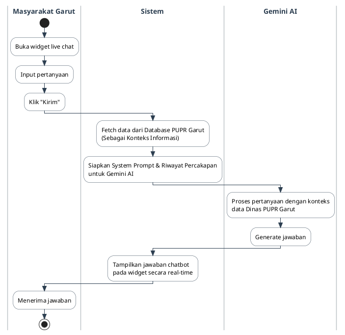
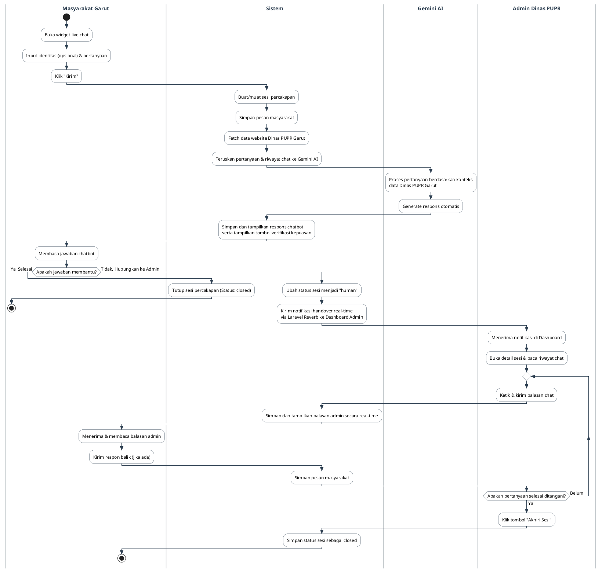

# PlantUML Activity Diagrams - SAPA PUPR Garut

Dokumen ini berisi kode source (DSL) PlantUML untuk menggambarkan alur aktivitas (Activity Diagram) pada modul **Live Chat Hybrid dengan Chatbot Gemini AI** pada website Dinas PUPR Kabupaten Garut.

Terdapat dua versi diagram yang disediakan:
1. **Opsi 1: Alur Chatbot Gemini AI (Sederhana)** - Sesuai dengan format dan struktur 3-swimlane pada contoh gambar (Masyarakat, Sistem, Gemini AI).
2. **Opsi 2: Alur Live Chat Hybrid (Lengkap)** - Alur penuh modul yang sesungguhnya (4-swimlane) mencakup penanganan oleh Admin ketika terjadi handover (sesuai implementasi proyek & dokumen skripsi).

---

## 1. Opsi 1: Alur Chatbot Gemini AI (Sederhana)

Diagram ini berfokus pada alur interaksi otomatis 3 pihak seperti pada contoh gambar.

### Kode PlantUML (DSL)

---

## 2. Opsi 2: Alur Live Chat Hybrid (Lengkap dengan Handover Admin)

Diagram ini merepresentasikan alur sesungguhnya yang ada di dalam aplikasi SAPA PUPR Garut, di mana masyarakat dapat beralih ke petugas (Admin) jika chatbot tidak memberikan jawaban yang memuaskan.

### Kode PlantUML (DSL)

---

## Cara Penggunaan di PlantUML
1. Salin salah satu blok kode `@startuml` sampai `@endum` di atas.
2. Tempelkan ke editor PlantUML favorit Anda:
   * [PlantUML Online Server](http://www.plantuml.com/plantuml)
   * Ekstensi PlantUML di VS Code.
   * Tool visualisasi UML lainnya yang mendukung format teks PlantUML.
