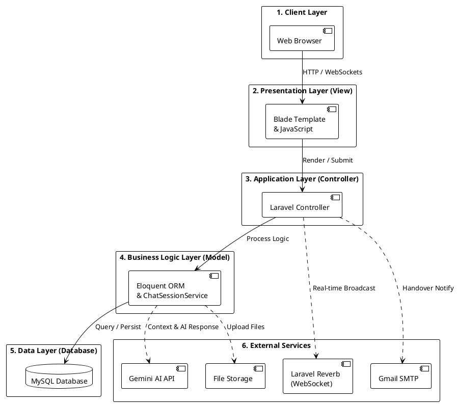
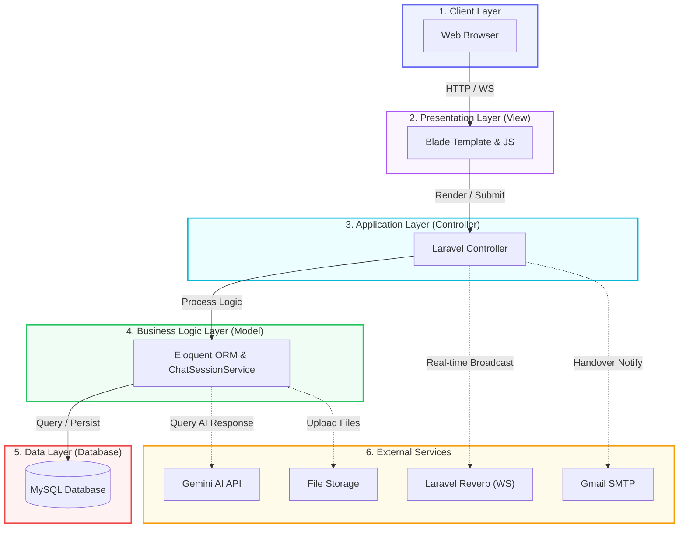

# Panduan Pembuatan Diagram Arsitektur Sistem
Dokumen ini berisi kumpulan prompt dan kode untuk membuat diagram arsitektur sistem proyek **Live Chat Hybrid dengan Chatbot Gemini AI** pada Website Dinas PUPR Kabupaten Garut, disesuaikan dengan contoh gambar referensi Anda.

---

## 1. Prompt Teks untuk AI (Eraser.io / ChatGPT / Claude)
*Gunakan prompt ini jika Anda ingin AI di website seperti **Eraser.io (Diagram GPT)**, **ChatGPT**, atau **Claude** membuatkan diagram secara otomatis:*

```text
Buatkan diagram arsitektur sistem aplikasi web berbasis Laravel MVC dengan layout vertikal ke bawah, persis seperti arsitektur berlapis (layered architecture). 

Diagram harus terdiri dari 6 kelompok (group/layer) berikut:
1. "1. Client Layer" (berwarna Biru): berisi komponen "Web Browser" (Masyarakat & Admin).
2. "2. Presentation Layer (View)" (berwarna Ungu): berisi komponen "Blade Template & JavaScript" (untuk Widget Chat & Dashboard Admin).
3. "3. Application Layer (Controller)" (berwarna Cyan): berisi komponen "Laravel Controller" (untuk handle HTTP Request & Logika Chat).
4. "4. Business Logic Layer (Model)" (berwarna Hijau): berisi komponen "Eloquent ORM & ChatSessionService" (untuk handle data context & business rules).
5. "5. Data Layer (Database)" (berwarna Merah): berisi komponen "MySQL Database" (sebagai penyimpanan data chat, session, & layanan).
6. "6. External Services" (berwarna Kuning/Orange di sisi kanan): berisi komponen:
   - "Laravel Reverb" (WebSocket server untuk real-time chat)
   - "Gemini AI API" (LLM untuk response generation otomatis)
   - "Gmail SMTP" (untuk mengirim notifikasi email saat handover)
   - "File Storage" (untuk menyimpan file upload pendukung)

Alur koneksi utama (panah solid vertikal ke bawah):
- Web Browser -> Blade Template & JS (HTTP Request / WebSockets)
- Blade Template & JS -> Laravel Controller (Render / Submit)
- Laravel Controller -> Eloquent ORM & ChatSessionService (Process Logic)
- Eloquent ORM & ChatSessionService -> MySQL Database (Query / Persist)

Alur koneksi eksternal (panah putus-putus ke arah kanan menuju External Services):
- Laravel Controller -> Laravel Reverb dengan label "Real-time Broadcast"
- Laravel Controller -> Gmail SMTP dengan label "Handover Notification"
- Eloquent ORM & ChatSessionService -> Gemini AI API dengan label "Context & AI Response"
- Eloquent ORM & ChatSessionService -> File Storage dengan label "Upload Files"

Pastikan styling-nya modern, bersih, dengan ikon yang relevan untuk setiap komponen.
```

---

## 2. Kode Eraser.io (Diagram-as-Code / DSL)
*Salin kode berikut dan tempelkan ke tab **Code** di editor **Eraser.io** untuk menggambar diagram secara instan:*

```eraser
// Konfigurasi Layout
layout: flow

// Komponen Utama
browser [label: "Web Browser", icon: "chrome"]
view [label: "Blade Template & JS", icon: "html"]
controller [label: "Laravel Controller", icon: "laravel"]
service [label: "Eloquent ORM / Service", icon: "cpu"]
db [label: "MySQL Database", icon: "mysql"]

// Kelompok Layer (Sesuai Gambar Referensi)
group client_layer [label: "1. Client Layer", color: "blue"] {
  browser
}

group presentation_layer [label: "2. Presentation Layer (View)", color: "purple"] {
  view
}

group application_layer [label: "3. Application Layer (Controller)", color: "cyan"] {
  controller
}

group business_layer [label: "4. Business Logic Layer (Model)", color: "green"] {
  service
}

group data_layer [label: "5. Data Layer (Database)", color: "red"] {
  db
}

// Kelompok Layanan Eksternal (Berada di Sisi Kanan)
group external_services [label: "6. External Services", color: "yellow"] {
  reverb [label: "Laravel Reverb (WS)", icon: "websocket"]
  gemini [label: "Gemini AI API", icon: "google-gemini"]
  smtp [label: "Gmail SMTP", icon: "mail"]
  storage [label: "File Storage", icon: "hard-disk"]
}

// Alur Koneksi Utama (Vertikal)
browser -> view : "HTTP / WebSocket Connections"
view -> controller : "Render / Submit"
controller -> service : "Process Logic"
service -> db : "Query / Persist"

// Alur Koneksi Eksternal (Horizontal / Putus-putus)
controller > reverb : "Real-time Broadcast"
controller > smtp : "Handover Notify"
service > gemini : "Query AI Response"
service > storage : "Upload Files"
```

---

## 3. Kode PlantUML (Untuk Dokumen Skripsi)
*Salin kode berikut untuk merender diagram menggunakan **PlantUML**:*



---

## 4. Kode Mermaid.js
*Gunakan kode berikut jika Anda ingin merendernya di editor Markdown (seperti GitHub, Notion, atau Obsidian):*


